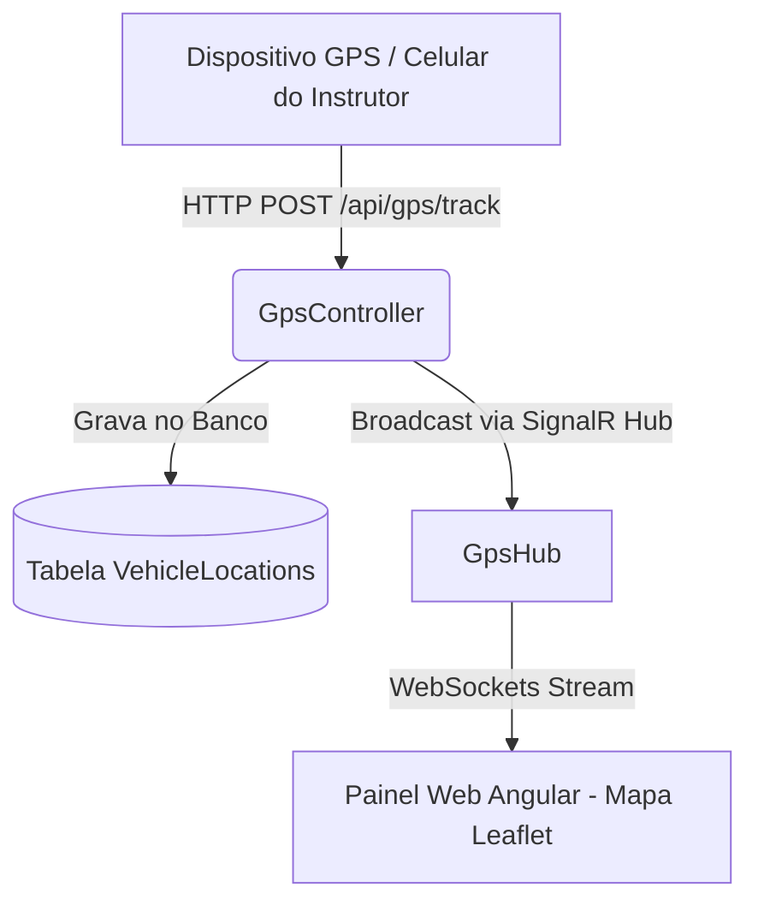

# Guia de Rastreio GPS em Tempo Real

Esta funcionalidade introduz a monitorização de veículos em tempo real no **FrotaGo ERP** através de WebSockets (SignalR) no Backend e um mapa Leaflet + OpenStreetMap interativo no Frontend Angular.

Adicionalmente, implementámos o suporte para que **qualquer dispositivo móvel (como o telemóvel de um instrutor)** partilhe a sua localização diretamente pelo browser.

---

## Como Funciona a Arquitetura de GPS

---

## 1. Como Partilhar o GPS do Telemóvel (Live Tracking)

Para ver o seu próprio dispositivo (ou telemóvel) a movimentar-se no mapa do site:

1. **Aceda à Aplicação pelo Telemóvel**:
   - Conecte o telemóvel à mesma rede Wi-Fi do computador.
   - Aceda pelo IP local do servidor no browser do telemóvel (ex: `http://192.168.1.100:4200/dashboard/tracking`).
2. **Selecione o Veículo**:
   - Toque no veículo que deseja pilotar/controlar.
3. **Inicie a Transmissão**:
   - Clique em **"GPS Celular"**.
   - O browser solicitará permissão de localização/GPS. **Permita**.
   - O botão ficará a piscar a vermelho com a legenda **"Parar GPS"**, indicando que o seu telemóvel está a enviar coordenadas a cada alteração de posição física.
4. **Veja no Computador**:
   - Abra a mesma página de Rastreio GPS num ecrã de computador. O veículo correspondente estará a mover-se exatamente onde o telemóvel se encontra em tempo real.

---

## 2. Como Testar Usando a Simulação (Ambiente Local)

Caso não queira mover-se fisicamente ou queira testar a funcionalidade diretamente no computador:

1. Aceda ao painel **"Rastreio GPS"** na barra lateral.
2. Selecione qualquer veículo da lista.
3. Clique em **"Simular"**.
4. O frontend começará a fazer pedidos simulados ao endpoint `api/gps/track` percorrendo um trajeto pré-definido em **Luanda (Marginal -> Kinaxixi -> Maianga)**.
5. O veículo começará a mover-se suavemente pelo mapa à medida que as coordenadas são recebidas via WebSockets.
